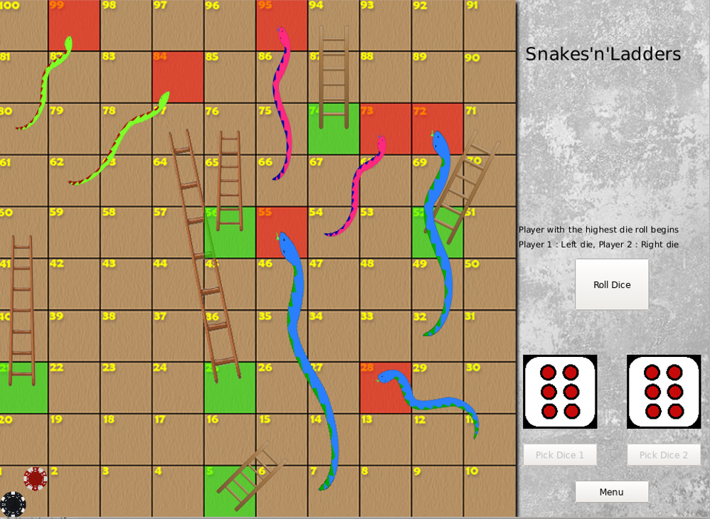
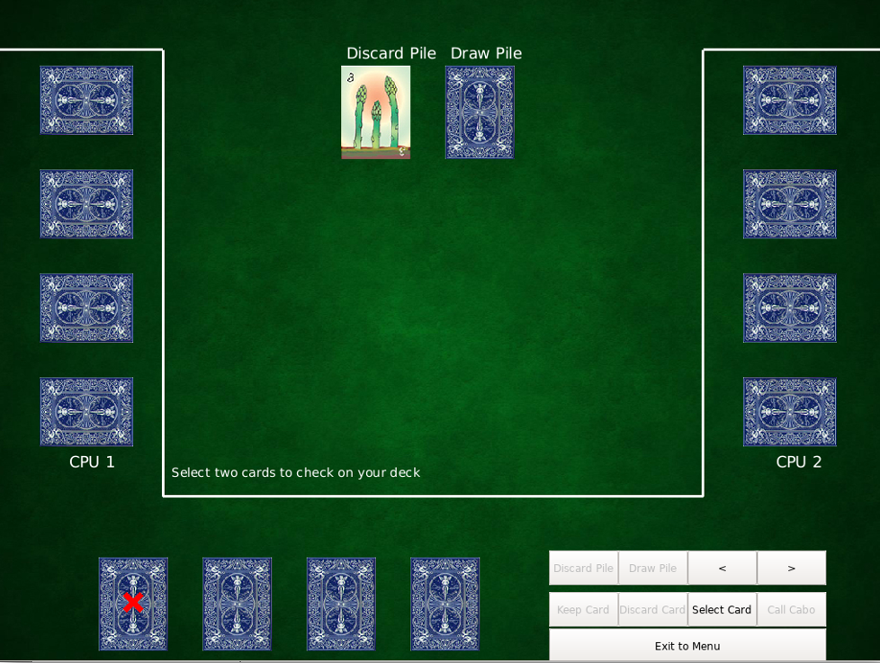

# Educational Game Platform

Realized by Mehieddine Zeidan and Hadi Sandid during Fall 2020 for the course EECE 435L (Software Tools).

This Education Game Platform is written in C++ and uses the QT framework. It offers a registration/login system, and two separate games (Snakes and Ladders & Cabo).

## Documentation

Doxygen has been used to generate documentation for our code in HTML format. It can be found [here](https://hsandid.github.io/EducationalGamePlatform).

If you'd like to generate the documentation yourself, a Doxyfile is included in the root folder for the project.

## Contents

- *src* folder :
   - Contains the source code used in the Educational Game Platform.
- *images* folder :
   - Contains all image assets used in the main GUI, and the two games.
- *sound_effects* folder :
   - Contains all sound assets.
- *json* folder :
   - Contains json data needed for *Snakes and Ladders* to function properly.
- *docs* folder :
   - Contains documentation for the source code, generated through Doxygen.

## Games Interface

- Snakes'n'Ladders

- Cabo

